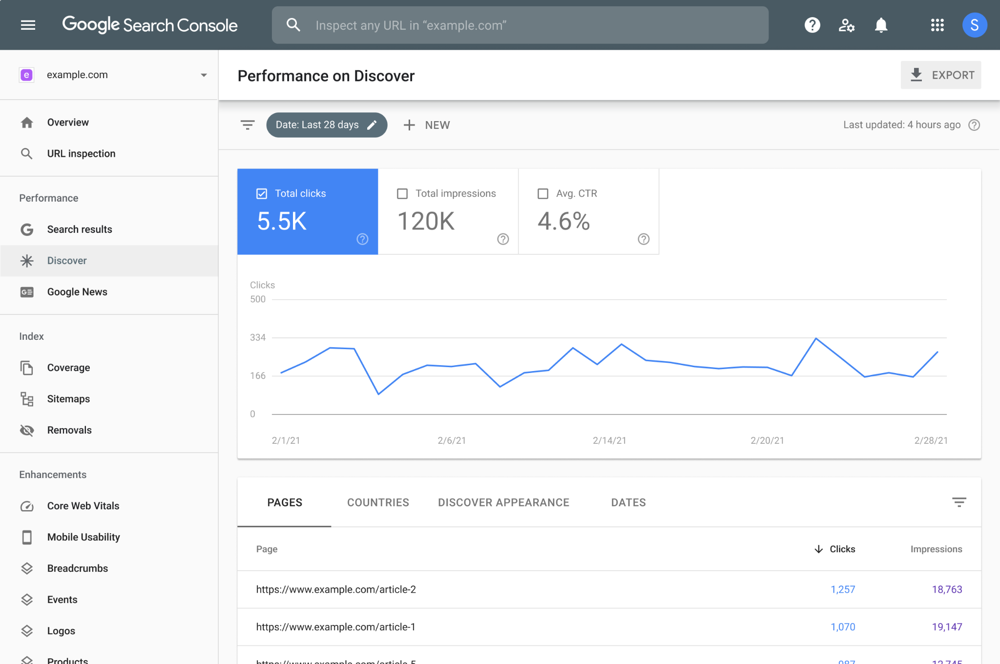

Authors
-------

**What is Google Search Console**

Google Search Console (GSC) is a free service from Google which offers
tools that help to monitor, maintain, and troubleshoot our site's
presence in Google Search results.

It's the perfect service for website owners, SEO professionals,
marketers, developers and more to gain insight on how they are
performing on Google Search

**Sample**

**
How to set up Google Search Console**

1. Sign into your Google account. Make sure you’re using your business
      (not personal) account if it’s a business website.

2. Go to Google Webmaster Tools.

3. Click “Add a property.”

4. Choose “Website” from the drop-down menu and enter the URL of your
      site. Make sure you’re using the exact URL that appears in the
      browser bar.

5. Click “Continue.”

6. Pick a way to verify you own your website (HTML file upload, domain
      name provider, HTML tag, GA tracking code, or GTM container
      snippet).

7. If you have access to the root of your website you can upload a html
      file.

8. If you manage your hosting yourself, you can verify via your hosting
      provider.

9. If you use Google Tag Manager, you can verify via Google Tags.

